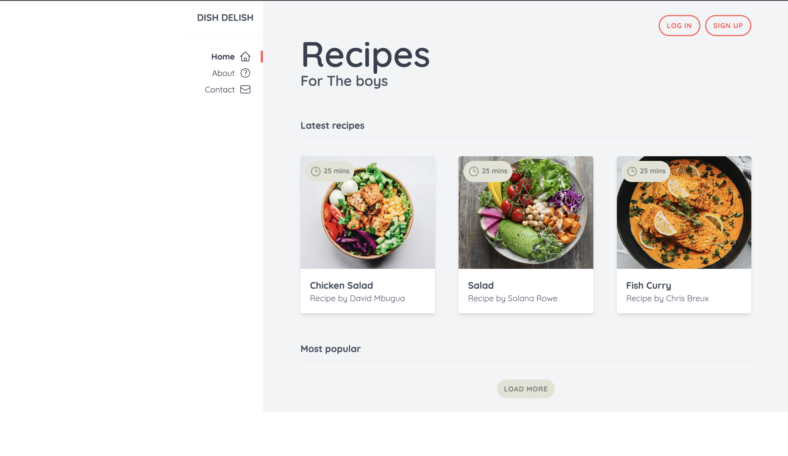
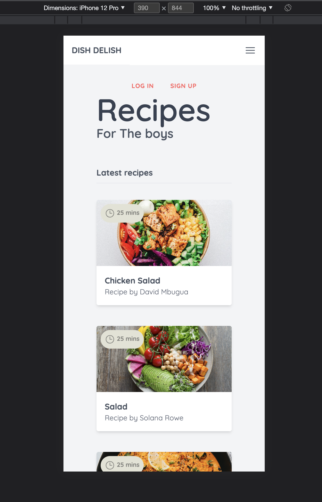

# Recipe Website
Welcome to my responsive recipe website! This website was created using Tailwind CSS and features a collection of tasty recipes that are easy to make at home. The site is fully responsive, so it looks great on all devices, from desktop computers to smartphones.

## Table of contents 
- Demo
- Installation
- Usage
- Screenshots

## Demo
Check out a live demo of the website here: https://dish-delish-theta.vercel.app/

## Installation
To run this website on your local machine, you'll need to have Node.js and npm installed. Once you have those installed, follow these steps:

- Clone the repository to your local machine
- Open a terminal window and navigate to the project directory
- Run the command npm install to install the project dependencies
- Run the command npm run dev to start the development server
- Open your web browser and navigate to http://localhost:3000

## Usage
Once everything is installed, you can view the website and check out the different UI/UX features I have used. You can also view in Mobile, iPad and Desktop view to see the responsiveness.

## Screenshots 

